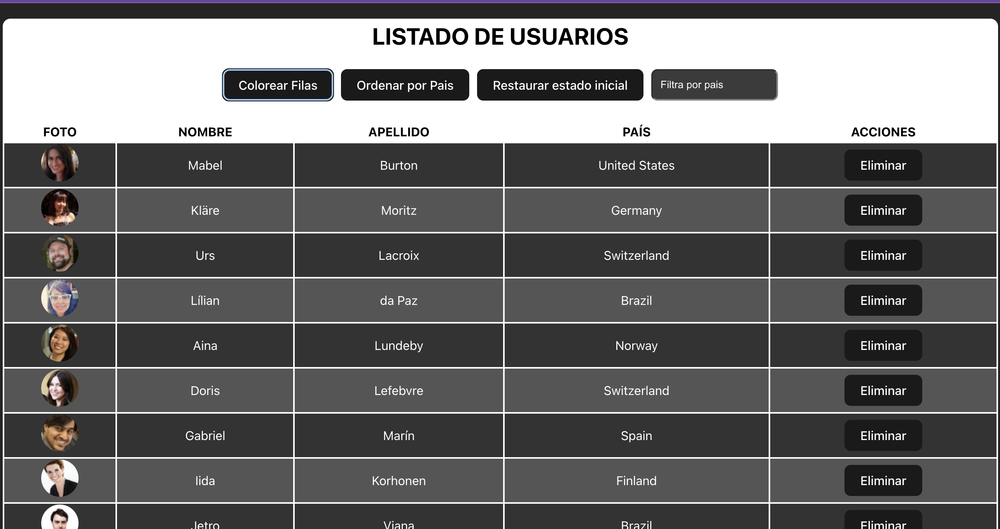

# react-vite-users-list
Listado de usuarios con React - Vite (Prueba técnica)<br>


<div align="left">

## 👋 Say Hello

Instagram: [@arvprincipe.dev](https://www.instagram.com/arvprincipe/) - Mi lugar favorito para publicar y compartir historias<br>
Facebook: [@arvprincipedev](https://www.facebook.com/arvprincipe) - Ver todos mis posts y donde anuncio cosas<br>
Linkedin: [@arvprincipe](https://www.linkedin.com/in/arvprincipe/) - Mi perfil para contactar<br>

## Download & Share 💾

 😎 ¡¡Absolutamente!! Puedes descargar y compartir mi código. . Si has obtenido algún valor de mi contenido y te gustaría ayudarme a llegar a más gente, por favor, ¡compártelo!

 😎 Absolutely!! You are welcome to dowload and share my code. . If you've gotten any value from my content and would like to help me reach more people, please do share!


## Contribution

🧰 Yes! Anyone is welcome to contribute to the quality of this content. Please feel free to submit a PR request for typo fixes, spelling corrections, explanation improvements, etc.

🧰 Sí. Cualquiera es bienvenido a contribuir a la calidad de este contenido. No dude en enviar una solicitud de relaciones públicas para corregir errores tipográficos u ortográficos, mejorar explicaciones, etc.

# Reglas del ejercicio 👇
### Prueba técnica con TypeScript y React

Esto es una prueba técnica de una empresa europea para un sueldo de 55000 €/anuales.

El objetivo de esta prueba técnica es crear una aplicación similar a la que se proporciona en este enlace: https://midu-react-11.surge.sh/. Para lograr esto, debe usar la API proporcionada por https://randomuser.me/.

Los pasos a seguir:

- [x] Fetch 100 rows of data using the API.
- [x] Display the data in a table format, similar to the example.
- [x] Provide the option to color rows as shown in the example.
- [x] Allow the data to be sorted by country as demonstrated in the example.
- [x] Enable the ability to delete a row as shown in the example.
- [x] Implement a feature that allows the user to restore the initial state, meaning that all deleted rows will be recovered.
- [x] Handle any potential errors that may occur.
- [x] Implement a feature that allows the user to filter the data by country.
- [x] Avoid sorting users again the data when the user is changing filter by country.
- [x] Sort by clicking on the column header.


## start the project 💻
- clone this repo
```bash
pnpm install
```

```bash
pnpm run dev
```

</div>
##### Ejercicio realizado en clase con @midudev